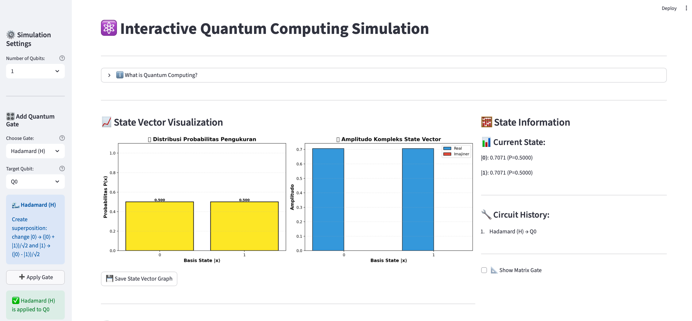
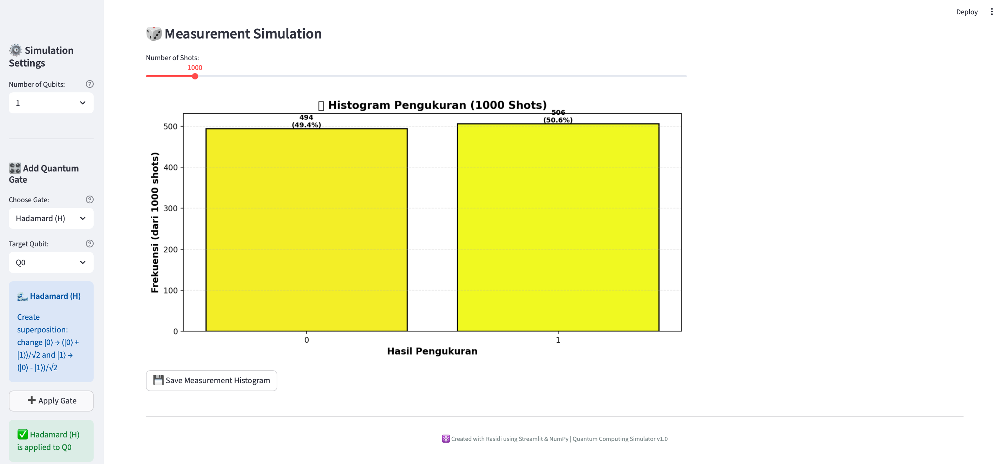

# ⚛️ Mini Quantum Lab — Streamlit Quantum Simulator

> 🧠 A lightweight interactive **Quantum Computing Simulator** built with **Python**, **Streamlit**, and **NumPy**.  
> Visualize qubit superposition, entanglement, and quantum gates in real time — right from your browser.

---

## 🚀 Overview

**Mini Quantum Lab** is a web-based simulator designed to help learners explore the foundations of **quantum mechanics and quantum computing** interactively.  
It allows users to visualize **quantum state evolution**, apply **quantum gates**, simulate **measurements**, and observe **probability distributions** dynamically.

This project is powered by:
- 🧮 **Streamlit** for an elegant and interactive web UI.
- ⚙️ **NumPy** for matrix-based quantum state computations.
- 📊 **Matplotlib** for live visualization of quantum states.

---

## 🧩 Key Features

✅ **Quantum State Simulation**
- Initialize up to **3 qubits**.
- View real-time state vector amplitudes and probabilities.

✅ **Quantum Gate Application**
- Supports **Hadamard**, **Pauli (X, Y, Z)**, **S**, **T**, and **CNOT** gates.
- Gates can be applied to specific qubits with visualization feedback.

✅ **Measurement Simulation**
- Perform quantum measurements with configurable **shots** (100–10,000).
- Observe measurement outcomes via **interactive histograms**.

✅ **Matrix Visualization**
- Inspect the **unitary matrix** of any gate.
- Explore the real & imaginary components of amplitudes.

✅ **Circuit History Tracking**
- Every applied gate is stored in a live-updating circuit log.

---

## 🧠 Visualization Example

### 🎛️ Quantum State Vector
Visualize amplitude and phase of each quantum basis state.



### 🎲 Measurement Histogram
Observe probabilistic measurement outcomes.



---

## 🧮 Quantum Gates Reference

| Gate | Description | Effect |
|------|--------------|---------|
| **Hadamard (H)** | Creates superposition | `|0⟩ → (|0⟩ + |1⟩)/√2` |
| **Pauli-X** | Bit flip (like NOT) | `|0⟩ ↔ |1⟩` |
| **Pauli-Y** | Rotation on Y-axis | Phase rotation |
| **Pauli-Z** | Phase flip | `|1⟩ → -|1⟩` |
| **S Gate** | π/2 phase shift | Adds phase `i` |
| **T Gate** | π/4 phase shift | Universal computation gate |
| **CNOT** | Two-qubit entanglement | Flips target if control = |1⟩ |

---

## 🧭 How to Run Locally

1. **Clone the repository**
   ```bash
   git clone https://github.com/rasidi3112/quantum-computing-simulation.git
   cd quantum-computing-simulation
